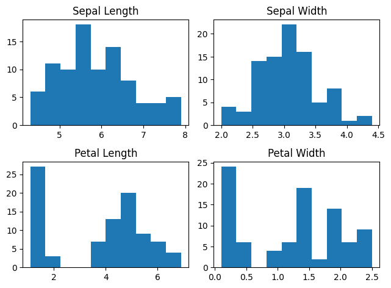
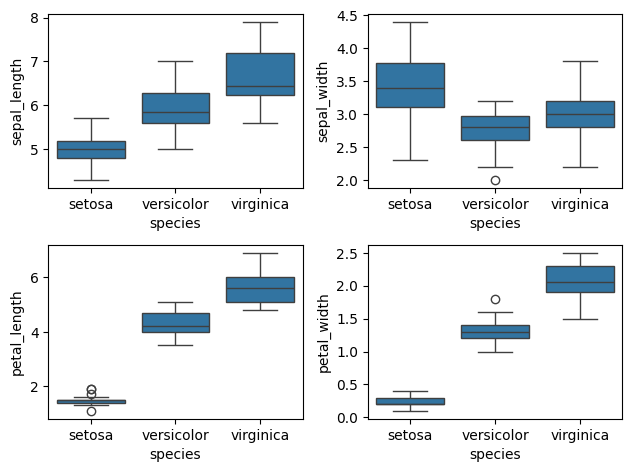
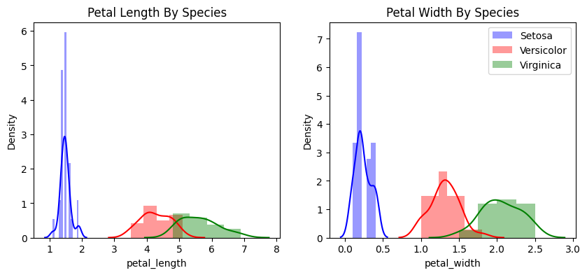
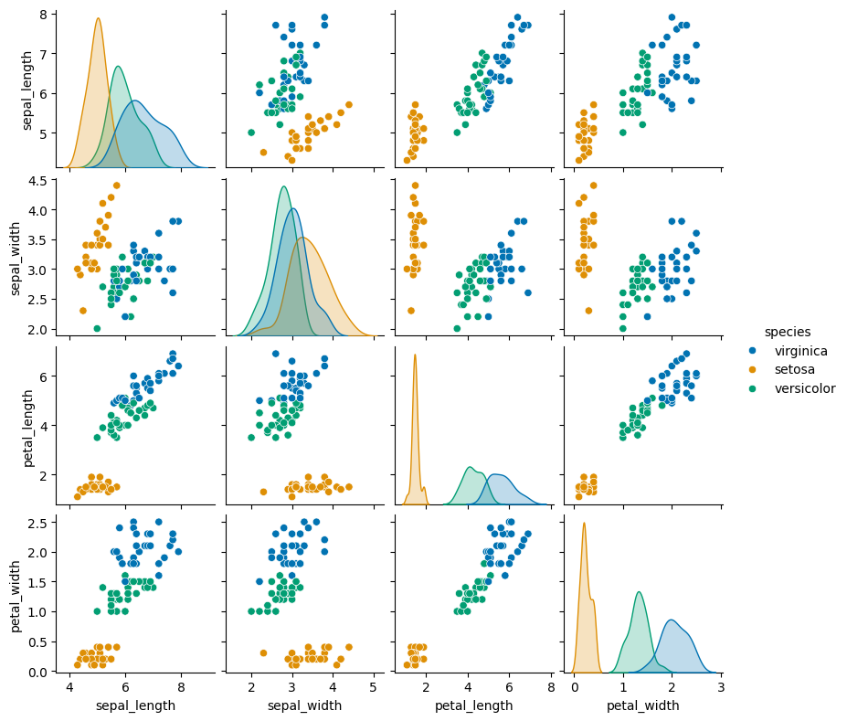
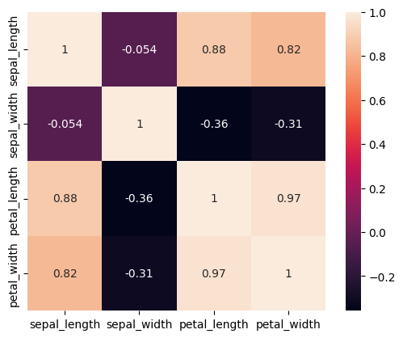
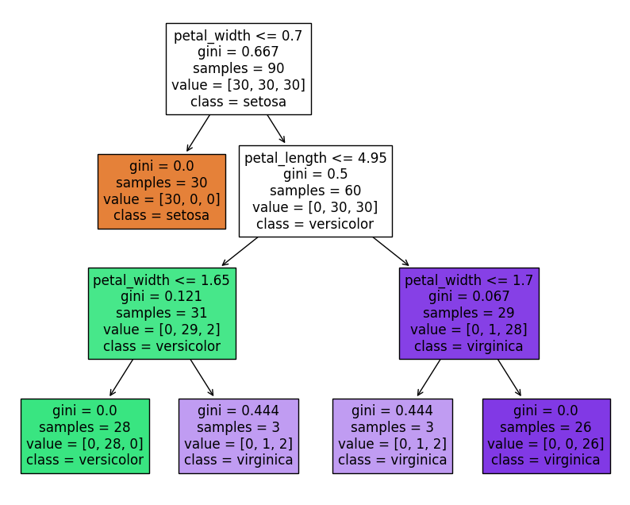
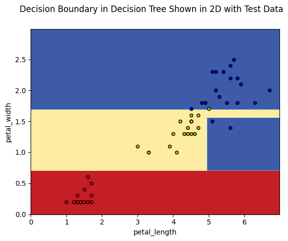
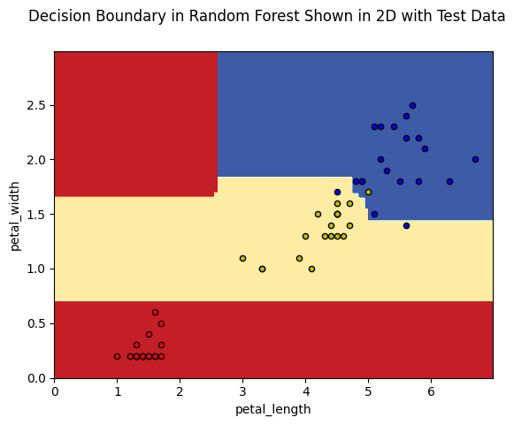

## Histograms for all the features, revealing their distribution

## Boxplots of all the features

## The distribution of petal length and width among Iris species

## Scatterplot matrix.

## Corrolation matrix

## Decision tree

## Decision boundary in decision tree

## Decision boundary in random forest

